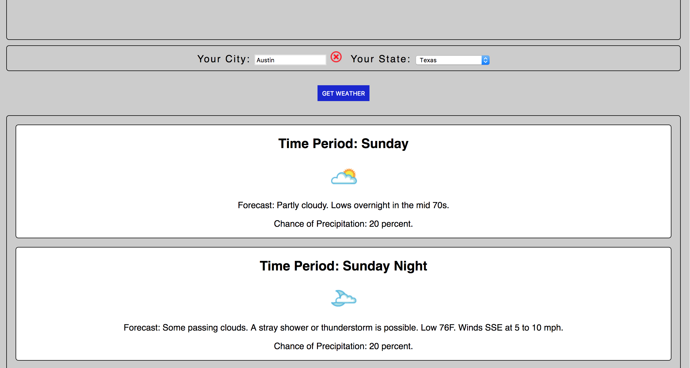

## Weathrly 3.0

This is an update for my [Weather App Real API](https://github.com/gness1804/weather-app-real-api). It is rebuilt with [Create React App](https://github.com/facebookincubator/create-react-app) in order to solve some ES6 issues and simplify configuration.

*In this app, the user can:*

* Select any US city and state and display a forecast of several days (sorry, no international locations yet).
* Select from a convenient dropdown of states.
* Geolocate (if the user enables this option), which auto-populates the city and state fields based on the user's location.

To run a development build:

* Clone down this repo.
* `npm start.`
